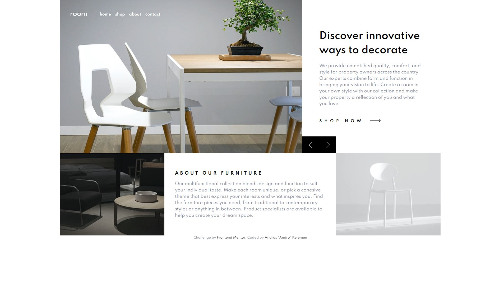

# Frontend Mentor - Room homepage solution

This is a solution to the [Room homepage challenge on Frontend Mentor](https://www.frontendmentor.io/challenges/room-homepage-BtdBY_ENq). Frontend Mentor challenges help you improve your coding skills by building realistic projects. 

## Table of contents

- [Overview](#overview)
  - [The challenge](#the-challenge)
  - [Screenshot](#screenshot)
  - [Links](#links)
- [My process](#my-process)
  - [Built with](#built-with)
  - [What I learned](#what-i-learned)
  - [Useful resources](#useful-resources)
- [Author](#author)

## Overview

### The challenge

Users should be able to:

- View the optimal layout for the site depending on their device's screen size
- See hover states for all interactive elements on the page
- Navigate the slider using either their mouse/trackpad or keyboard

### Screenshot

### Links

- Solution URL: [Add solution URL here](https://github.com/androgitai/RoomHomePage)
- Live Site URL: [Add live site URL here](https://room-homepage-andro.netlify.app/)

## My process

### Built with

- Semantic HTML5 markup
- Flexbox
- CSS Grid
- Mobile-first workflow
- Tailwind CSS
- JavaScript

### What I learned

I leared a lot about the power of Tailwind CSS. It is very easy to do a quick a wireframe or even more complicated websites and it is a lot more felxible than Bootstap. I really like how customizable the framework is.

### Useful resources

- [Tailwind CSS](https://tailwindcss.com/) - The docs are amazing and easy make sure you check it out!

## Author

- Website - [Andras "Andro" Kelemen](https://github.com/androgitai)
- Frontend Mentor - [@androgitai](https://www.frontendmentor.io/profile/androgitai)

